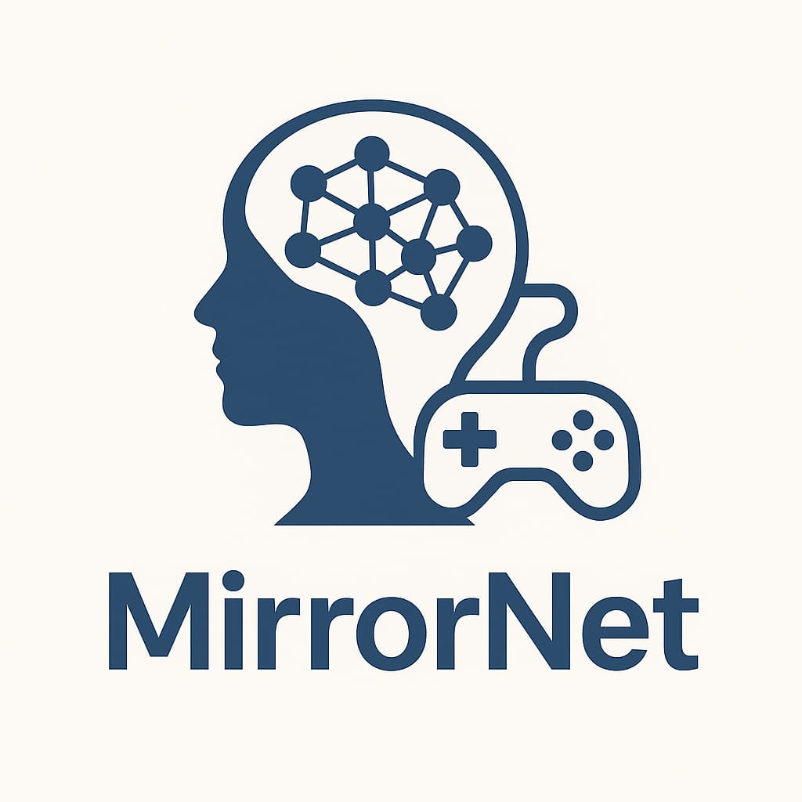

</img>
An universal reinforcement learning framework that can learn any game just by observing and imitating the player.

Quick view:
- Trainable Reinforcement Agent for any Game (to a specific playstyle)
- User may have to set Monitor to observe + set input device
- With modern GUI using PyQt
- Add a Agent for a new game (will only change a number input)
- Multimodal input (audio, visual, past, game)
- The Architecture uses pretrained parts
- RF Agent will get pretrained on available datasets
- Maybe also using contrastive learning
- Trying few-shot or meta-learning techniques
- Connecting with generative models? (GAN train technique?)
    - Could record gaming sessions and learn afterwards with it with a partwise GAN training process
(make a visualization for this?)


An universal Game AI application with GUI, where a user can create/load a reinforcement model, set the monitor to watch and set the input device / action space.<br>
Then the model can be set on watch mode, where the model sees the actions from the player as its own actions and sees the environment as the set display. <br>
The Input could be multimodal, the pretrained audio features, pretrained CNN/Transformer features and pretrained segmentation+classification and a number/vector which decided which game is currently played.<br>
The reinforcement/reward is in watchmode always the best, because the goal is to play as the player also with mistakes.<br>
In the GUI there can be added multiple Agents, idea here is to don't actually create a new agent, but just change one numerical input value (one hot encoded does not work, because there could be endless games...but a vector with 1000 values could also work but have a limit of 1000 games). Benefit is that the learning could be increased but it also could happen that the learning is slowed/confused.
In a final state this input number/vector could be learned by another detection AI/NN. <br>
The AI should be able to set in play mode where the AI will try to control your player. This could work with direct control or first just with sending the commands over a txt or another way.<br>

Possibilities:
- Learning multiple games (?)
- Learning any game just by playing and activate watch mode during your gaming session

Critisism:
- The Gaming Sessions are propably not enough for 
- The performance is propably to slow

<br>

---
### To Do

- [ ] Add GUI
- [ ] Add basic program
- [ ] Add basic ai architecture
- [ ] Fix/add the multimodal input
- [ ] Download datasets
- [ ] Pretrain agent
- [ ] How to avoid inferences between different games?
- [ ] Which few-shot or meta-learning techniques are there?
- [ ] Which data is available?
- [ ] Add Bottlenecks + Skip-Connections into the Architecture
- [ ] Add concepts from generative models

<br>

---
### Code Ideas

**RL Agent**
```Python
import torch
import torch.nn as nn
import torch.nn.functional as F

# --- Vision Encoder (e.g., CNN) ---
class VisionEncoder(nn.Module):
    def __init__(self, out_dim=128):
        super().__init__()
        self.cnn = nn.Sequential(
            nn.Conv2d(3, 32, 5, stride=2),  # input: [B, 3, H, W]
            nn.ReLU(),
            nn.Conv2d(32, 64, 5, stride=2),
            nn.ReLU(),
            nn.AdaptiveAvgPool2d((4, 4)),
            nn.Flatten()
        )
        self.fc = nn.Linear(64 * 4 * 4, out_dim)

    def forward(self, x):
        x = self.cnn(x)
        return self.fc(x)

# --- Audio Encoder ---
class AudioEncoder(nn.Module):
    def __init__(self, input_dim, out_dim=64):
        super().__init__()
        self.fc = nn.Sequential(
            nn.Linear(input_dim, 128),
            nn.ReLU(),
            nn.Linear(128, out_dim)
        )

    def forward(self, x):
        return self.fc(x)

# --- Past Embedding ---
# FIXME

# --- Game ID Embedding ---
class GameIDEncoder(nn.Module):
    def __init__(self, game_vector_dim, out_dim=64):
        super().__init__()
        self.fc = nn.Sequential(
            nn.Linear(game_vector_dim, 128),
            nn.ReLU(),
            nn.Linear(128, out_dim)
        )

    def forward(self, x):
        return self.fc(x)

# --- Policy Network ---
class PolicyNet(nn.Module):
    def __init__(self, obs_dim, action_dim):
        super().__init__()
        self.fc = nn.Sequential(
            nn.Linear(obs_dim, 256),
            nn.ReLU(),
            nn.Linear(256, action_dim)
        )

    def forward(self, x):
        return self.fc(x)

# --- Full Agent ---
class UniversalAgent(nn.Module):
    def __init__(self, audio_input_dim, game_vector_dim, action_dim):
        super().__init__()
        self.vision = VisionEncoder(out_dim=128)
        self.audio = AudioEncoder(audio_input_dim, out_dim=64)
        self.gameid = GameIDEncoder(game_vector_dim, out_dim=64)
        self.policy = PolicyNet(obs_dim=128 + 64 + 64, action_dim=action_dim)

    def forward(self, img, audio_feat, game_vec):
        img_feat = self.vision(img)
        audio_feat = self.audio(audio_feat)
        game_feat = self.gameid(game_vec)
        full_obs = torch.cat([img_feat, audio_feat, game_feat], dim=1)
        return self.policy(full_obs)
```


**Mirror Learning**
```python
def watch_mode_training_step(agent, optimizer, img, audio_feat, game_vec, action):
    agent.train()
    pred_action = agent(img, audio_feat, game_vec)
    loss = F.mse_loss(pred_action, action)  # imitation learning (regression)
    optimizer.zero_grad()
    loss.backward()
    optimizer.step()
    return loss.item()

```


**Inference**
```python
def play_mode(agent, img, audio_feat, game_vec):
    agent.eval()
    with torch.no_grad():
        action = agent(img, audio_feat, game_vec)
    return action
```

**GUI**
```python
# pip install pyqt5

import sys
from PyQt5.QtWidgets import (
    QApplication, QWidget, QVBoxLayout, QPushButton,
    QLabel, QListWidget, QHBoxLayout, QFileDialog,
    QComboBox, QFrame
)
from PyQt5.QtCore import Qt
from PyQt5.QtGui import QFont

class GameAIGUI(QWidget):
    def __init__(self):
        super().__init__()
        self.setWindowTitle("Universal Game AI")
        self.setGeometry(100, 100, 1000, 600)
        self.setStyleSheet(self.styles())

        self.initUI()

    def initUI(self):
        layout = QHBoxLayout()
        sidebar = self.initSidebar()
        mainPanel = self.initMainPanel()

        layout.addWidget(sidebar)
        layout.addWidget(mainPanel)

        self.setLayout(layout)

    def initSidebar(self):
        sidebar = QFrame()
        sidebar.setFrameShape(QFrame.StyledPanel)
        sidebar.setFixedWidth(250)
        sidebar.setStyleSheet("background-color: #2c2f33;")

        layout = QVBoxLayout()

        title = QLabel("Agents")
        title.setFont(QFont("Segoe UI", 14))
        title.setStyleSheet("color: white;")
        layout.addWidget(title)

        self.agentList = QListWidget()
        layout.addWidget(self.agentList)

        self.addAgentBtn = QPushButton("Add Agent")
        self.addAgentBtn.clicked.connect(self.addAgent)
        layout.addWidget(self.addAgentBtn)

        self.removeAgentBtn = QPushButton("Remove Agent")
        self.removeAgentBtn.clicked.connect(self.removeAgent)
        layout.addWidget(self.removeAgentBtn)

        sidebar.setLayout(layout)
        return sidebar

    def initMainPanel(self):
        main = QFrame()
        main.setFrameShape(QFrame.StyledPanel)

        layout = QVBoxLayout()

        self.modelLabel = QLabel("Model: None")
        self.modelLabel.setStyleSheet("color: white; font-size: 16px;")
        layout.addWidget(self.modelLabel)

        loadBtn = QPushButton("Load Model")
        loadBtn.clicked.connect(self.loadModel)
        layout.addWidget(loadBtn)

        self.modeBtn = QPushButton("Switch to Watch Mode")
        self.modeBtn.setCheckable(True)
        self.modeBtn.clicked.connect(self.toggleMode)
        layout.addWidget(self.modeBtn)

        layout.addWidget(QLabel("Input Device:"))
        self.inputBox = QComboBox()
        self.inputBox.addItems(["Keyboard", "Controller", "Simulated"])
        layout.addWidget(self.inputBox)

        layout.addWidget(QLabel("Action Space:"))
        self.actionBox = QComboBox()
        self.actionBox.addItems(["Discrete", "Continuous"])
        layout.addWidget(self.actionBox)

        main.setLayout(layout)
        main.setStyleSheet("background-color: #23272a; padding: 20px;")
        return main

    def addAgent(self):
        agent_count = self.agentList.count()
        self.agentList.addItem(f"Agent {agent_count + 1}")

    def removeAgent(self):
        selected = self.agentList.currentRow()
        if selected >= 0:
            self.agentList.takeItem(selected)

    def loadModel(self):
        fileName, _ = QFileDialog.getOpenFileName(self, "Load Model", "", "PyTorch Model (*.pt *.pth)")
        if fileName:
            self.modelLabel.setText(f"Model: {fileName.split('/')[-1]}")

    def toggleMode(self):
        if self.modeBtn.isChecked():
            self.modeBtn.setText("Switch to Play Mode")
        else:
            self.modeBtn.setText("Switch to Watch Mode")

    def styles(self):
        return """
        QWidget {
            background-color: #36393f;
            font-family: 'Segoe UI';
        }
        QPushButton {
            background-color: #7289da;
            color: white;
            border-radius: 5px;
            padding: 8px;
        }
        QPushButton:hover {
            background-color: #5b6eae;
        }
        QLabel {
            color: white;
        }
        QListWidget {
            background-color: #40444b;
            color: white;
            border: none;
        }
        QComboBox {
            background-color: #40444b;
            color: white;
            padding: 6px;
            border-radius: 3px;
        }
        """

if __name__ == "__main__":
    app = QApplication(sys.argv)
    gui = GameAIGUI()
    gui.show()
    sys.exit(app.exec_())
```

**Mouse Actions**
```python
import pyautogui
import keyboard

# Move mouse to (100, 100) and click
pyautogui.moveTo(100, 100)
pyautogui.click()

# Press space key
keyboard.press('space')
keyboard.release('space')
```

**Controller Actions**
```python
import vgamepad as vg
import time

gamepad = vg.VX360Gamepad()

# Press A button
gamepad.press_button(button=vg.XUSB_BUTTON.XUSB_GAMEPAD_A)
gamepad.update()
time.sleep(0.5)

# Release A button
gamepad.release_button(button=vg.XUSB_BUTTON.XUSB_GAMEPAD_A)
gamepad.update()
```

**Reading Screen**
```python
import mss
import numpy as np

with mss.mss() as sct:
    monitor = sct.monitors[1]  # Full screen
    screenshot = sct.grab(monitor)
    img = np.array(screenshot)
```

**Reading Audio**
```python
import sounddevice as sd
import soundfile as sf
import numpy as np

duration = 5  # seconds
sample_rate = 48000

# List devices
for i, device in enumerate(sd.query_devices()):
    print(i, device['name'])

# Find your loopback device (usually "Speakers (loopback)" or similar)
device_index = ...  # replace with correct index

print("Recording system audio...")
recording = sd.rec(int(duration * sample_rate), samplerate=sample_rate, channels=2,
                   dtype='float32', device=device_index)
sd.wait()
print("Done.")

sf.write('system_audio.wav', recording, sample_rate)
```

**Buffered/Rolled Input** (to get the past)

```python
from collections import deque
import numpy as np

# For example: store 2 seconds of audio with 48kHz sample rate
BUFFER_DURATION = 2
SAMPLE_RATE = 48000
NUM_CHANNELS = 2

buffer = deque(maxlen=BUFFER_DURATION * SAMPLE_RATE)

# During streaming, keep appending new samples:
def on_audio_data(audio_chunk):
    buffer.extend(audio_chunk.flatten())

# When needed:
past_audio = np.array(buffer)
```

```python
from collections import deque

# Store the last 5 frames
frame_buffer = deque(maxlen=5)

# Append new frames as they come (e.g., numpy arrays)
frame_buffer.append(current_frame)
```

```python
action_buffer = deque(maxlen=20)
action_buffer.append(current_action)
```

```python
# Combine last N frames and actions
stacked_input = np.concatenate(list(frame_buffer) + list(action_buffer), axis=-1)

# or maybe

model_input = {
  'past_audio': past_audio,
  'past_frames': list(frame_buffer),
  'past_actions': list(action_buffer)
}
```


<br>

---
### Datasets

Often uses PyTorch + OpenAI Gym.

- [D4RL (Offline RL Datasets)](https://github.com/Farama-Foundation/D4RL)
- Atari 2600 Datasets
    - Atari 100k
    - ALE
    - RLDatasets
- [ Reinforcement Learning Datasets](https://github.com/google-research/rlds)
- [MineRL](https://minerl.io/)
- CARLA / TORCS (Driving Sim)
- Using [ViZDoom](https://vizdoom.cs.put.edu.pl) creating own dataset


<br>

---
### Ressources

The biggest ressources for this project are:
- [Deep Reinforcement Book by Aske Plaat](https://arxiv.org/abs/2201.02135)
- [Practical AI with Python and Reinforcement Learning](https://www.udemy.com/course/practical-ai-with-python-and-reinforcement-learning/)
- [Offenburg University of Applied Sciences]()
- [Deep Reinforcement Learning: Das umfassende Praxis-Handbuch](https://www.amazon.de/Deep-Reinforcement-Learning-Praxis-Handbuch-Professional)

Look for papers in this area.


